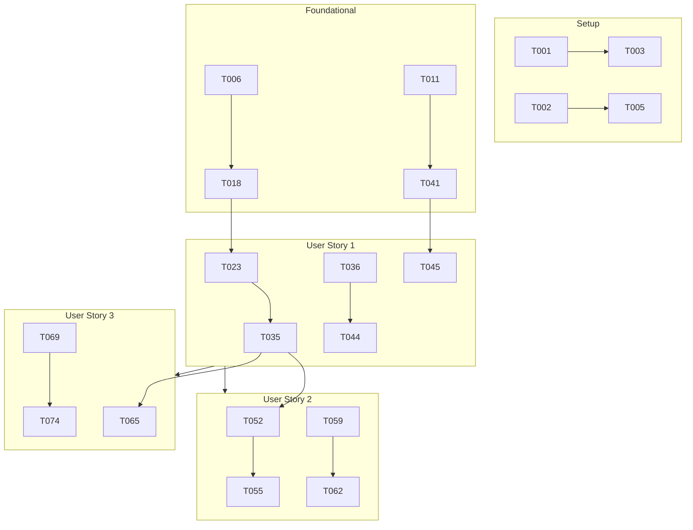

# Task List: Refactor Ingestion Pipeline & Integrate ML Service

**Epic/Feature:** [008-ml-ingestion-integration](./spec.md)

**Branch:** `008-ml-ingestion-integration`

**Owner:** Development Team

---

## Overview

This task list implements the refactored ingestion pipeline where `python-ingestion` acts as a data courier and delegates parsing to `ml-analyze`. Tasks are organized by user story for independent implementation and testing.

---

## User Story Mapping

| Story | Priority | Description | Tasks |
|-------|----------|-------------|-------|
| US1 | P1 | Admin Uploads File for ML Processing | T006-T018 |
| US2 | P2 | Scheduled Sync Uses ML Pipeline | T019-T024 |
| US3 | P3 | Retry Failed Jobs | T025-T030 |

---

## Phase 1: Setup & Infrastructure

**Goal:** Prepare environment and verify existing infrastructure works for the feature.

**Independent Test:** Both services can access shared volume; internal network works.

- [X] T001 Add environment variables to `services/python-ingestion/.env.example`: ML_ANALYZE_URL, USE_ML_PROCESSING
- [X] T002 Add environment variables to `services/bun-api/.env.example`: ML_ANALYZE_URL
- [X] T003 [P] Verify shared volume access from worker container via docker-compose exec
- [X] T004 [P] Verify shared volume access from ml-analyze container via docker-compose exec
- [X] T005 [P] Test internal network connectivity: worker → ml-analyze:8001/health

---

## Phase 2: Foundational (Blocking Prerequisites)

**Goal:** Create shared data models used by multiple user stories.

**Independent Test:** Models compile without errors; types are consistent across services.

### Python Models

- [X] T006 Create Pydantic model `MLAnalyzeRequest` in `services/python-ingestion/src/models/ml_models.py`
- [X] T007 Create Pydantic model `MLAnalyzeResponse` in `services/python-ingestion/src/models/ml_models.py`
- [X] T008 Create Pydantic model `MLJobStatus` in `services/python-ingestion/src/models/ml_models.py`
- [X] T009 Create Pydantic model `JobProgressUpdate` in `services/python-ingestion/src/models/ml_models.py`
- [X] T010 [P] Create Pydantic model `FileMetadata` for sidecar JSON in `services/python-ingestion/src/models/ml_models.py`

### TypeScript Types

- [X] T011 [P] Create TypeScript type `JobPhase` in `services/frontend/src/types/ingestion.ts`
- [X] T012 [P] Create TypeScript interface `DownloadProgress` in `services/frontend/src/types/ingestion.ts`
- [X] T013 [P] Create TypeScript interface `AnalysisProgress` in `services/frontend/src/types/ingestion.ts`
- [X] T014 [P] Create TypeScript interface `IngestionJob` in `services/frontend/src/types/ingestion.ts`
- [X] T015 [P] Extend TypeScript interface `Supplier` with `use_ml_processing` in `services/frontend/src/types/supplier.ts`

### Bun API Types

- [X] T016 [P] Create TypeBox schema `IngestionJobSchema` in `services/bun-api/src/types/ingestion.types.ts`
- [X] T017 [P] Create TypeBox schema `RetryJobSchema` in `services/bun-api/src/types/ingestion.types.ts`

---

## Phase 3: User Story 1 - Admin Uploads File for ML Processing [US1]

**Goal:** Admin can upload a file, see ML processing phases, and view results.

**Independent Test:** 
1. Upload Excel file via UI with ML toggle ON
2. Observe phases: Downloading → Analyzing → Complete
3. Verify items in database with match status

### Backend: ML Client (python-ingestion)

- [X] T018 [US1] Create `MLClient` class with httpx async client in `services/python-ingestion/src/services/ml_client.py`
- [X] T019 [US1] Implement `check_health()` method with retry logic in `services/python-ingestion/src/services/ml_client.py`
- [X] T020 [US1] Implement `trigger_analysis()` method in `services/python-ingestion/src/services/ml_client.py`
- [X] T021 [US1] Implement `get_job_status()` method in `services/python-ingestion/src/services/ml_client.py`
- [X] T022 [US1] Export singleton `ml_client` instance in `services/python-ingestion/src/services/ml_client.py`

### Backend: Download Tasks (python-ingestion)

- [X] T023 [US1] Create `download_and_trigger_ml` task function in `services/python-ingestion/src/tasks/download_tasks.py`
- [X] T024 [US1] Implement `_download_file()` helper for Google Sheets export to XLSX in `services/python-ingestion/src/tasks/download_tasks.py`
- [X] T025 [US1] Implement `_download_file()` helper for CSV/Excel file copy in `services/python-ingestion/src/tasks/download_tasks.py`
- [X] T026 [US1] Implement `_download_file()` helper for URL download in `services/python-ingestion/src/tasks/download_tasks.py`
- [X] T027 [US1] Implement `_compute_md5()` checksum function in `services/python-ingestion/src/tasks/download_tasks.py`
- [X] T028 [US1] Implement `_write_metadata_sidecar()` function in `services/python-ingestion/src/tasks/download_tasks.py`
- [X] T029 [US1] Implement `_update_job_phase()` Redis helper in `services/python-ingestion/src/tasks/download_tasks.py`

### Backend: Google Sheets Export

- [X] T030 [US1] Add `export_to_xlsx()` method to `GoogleSheetsParser` class in `services/python-ingestion/src/parsers/google_sheets_parser.py`

### Backend: Job State Management

- [X] T031 [US1] Create job creation helper `create_job()` in `services/python-ingestion/src/services/job_state.py`
- [X] T032 [US1] Create job update helper `update_job()` in `services/python-ingestion/src/services/job_state.py`
- [X] T033 [US1] Create job getter `get_job()` in `services/python-ingestion/src/services/job_state.py`
- [X] T034 [US1] Create job listing `get_recent_jobs()` in `services/python-ingestion/src/services/job_state.py`

### Backend: Worker Registration

- [X] T035 [US1] Register `download_and_trigger_ml` task in `services/python-ingestion/src/worker.py`

### API: Enhanced Status Endpoint (Bun)

- [X] T036 [US1] Extend `GET /admin/sync/status` response with `jobs` array in `services/bun-api/src/services/ingestion.service.ts`
- [X] T037 [US1] Extend `GET /admin/sync/status` response with `current_phase` field in `services/bun-api/src/services/ingestion.service.ts`
- [X] T038 [US1] Create `IngestionService.getRecentJobsFromRedis()` method in `services/bun-api/src/services/ingestion.service.ts`

### API: Upload with ML Toggle (Bun)

- [X] T039 [US1] Update `POST /admin/suppliers` to accept `use_ml_processing` field in `services/bun-api/src/db/repositories/supplier.repository.ts`
- [X] T040 [US1] Store `use_ml_processing` in supplier meta JSONB in `services/bun-api/src/services/supplier.service.ts`

### Frontend: Phase Indicator Component

- [X] T041 [US1] Create `JobPhaseIndicator.tsx` component in `services/frontend/src/components/admin/JobPhaseIndicator.tsx`
- [X] T042 [US1] Implement phase-specific icons and colors in `JobPhaseIndicator.tsx`
- [X] T043 [US1] Implement progress bar with percentage in `JobPhaseIndicator.tsx`

### Frontend: Status Integration

- [X] T044 [US1] Update `useIngestionStatus` hook to parse `jobs` array in `services/frontend/src/types/ingestion.ts`
- [X] T045 [US1] Update `SyncControlCard` to render `JobPhaseIndicator` for active jobs in `services/frontend/src/components/admin/SyncControlCard.tsx`

### Frontend: ML Toggle in Upload Modal

- [X] T046 [US1] Add "Process via ML" toggle to `SupplierAddModal` in `services/frontend/src/components/admin/SupplierAddModal.tsx`
- [X] T047 [US1] Wire toggle to `use_ml_processing` field in form submission in `services/frontend/src/components/admin/SupplierAddModal.tsx`

### Frontend: Translations

- [X] T048 [P] [US1] Add phase translations to `services/frontend/public/locales/en/translation.json`
- [X] T049 [P] [US1] Add phase translations to `services/frontend/public/locales/ru/translation.json`
- [X] T050 [P] [US1] Add ML toggle translations to `services/frontend/public/locales/en/translation.json`
- [X] T051 [P] [US1] Add ML toggle translations to `services/frontend/public/locales/ru/translation.json`

---

## Phase 4: User Story 2 - Scheduled Sync Uses ML Pipeline [US2]

**Goal:** Scheduled syncs automatically route files through ML processing.

**Independent Test:**
1. Configure Master Sheet with 2+ suppliers
2. Trigger manual sync via Admin UI
3. Observe all suppliers processed via ML pipeline
4. Verify items in database

### Backend: Update Sync Tasks

- [X] T052 [US2] Modify `_enqueue_supplier_parse()` to use `download_and_trigger_ml` in `services/python-ingestion/src/tasks/sync_tasks.py`
- [X] T053 [US2] Add `use_ml_processing` flag check in `_enqueue_supplier_parse()` in `services/python-ingestion/src/tasks/sync_tasks.py`
- [X] T054 [US2] Update `trigger_master_sync_task` to track ML job IDs in `services/python-ingestion/src/tasks/sync_tasks.py`

### Backend: ML Job Status Polling

- [X] T055 [US2] Create `poll_ml_job_status_task` to poll ML service in `services/python-ingestion/src/tasks/ml_polling_tasks.py`
- [X] T056 [US2] Implement exponential backoff for ML polling in `services/python-ingestion/src/tasks/ml_polling_tasks.py`
- [X] T057 [US2] Update Redis job state from ML status response in `services/python-ingestion/src/tasks/ml_polling_tasks.py`
- [X] T058 [US2] Register `poll_ml_job_status_task` in worker in `services/python-ingestion/src/worker.py`

### Backend: File Cleanup

- [X] T059 [US2] Create `cleanup_shared_files_task` cron task in `services/python-ingestion/src/tasks/cleanup_tasks.py`
- [X] T060 [US2] Implement 24-hour TTL cleanup logic in `services/python-ingestion/src/tasks/cleanup_tasks.py`
- [X] T061 [US2] Delete both file and `.meta.json` sidecar in `services/python-ingestion/src/tasks/cleanup_tasks.py`
- [X] T062 [US2] Register cleanup task as cron (every 6 hours) in `services/python-ingestion/src/worker.py`

### Frontend: Per-Supplier Progress

- [X] T063 [US2] Update `SupplierStatusTable` to show ML processing status in `services/frontend/src/components/admin/SupplierStatusTable.tsx`
- [X] T064 [US2] Add `use_ml_processing` badge to supplier row in `services/frontend/src/components/admin/SupplierStatusTable.tsx`

---

## Phase 5: User Story 3 - Retry Failed Jobs [US3]

**Goal:** Admin can retry failed jobs without re-uploading files.

**Independent Test:**
1. Stop ML service to cause failure
2. Observe job marked as "failed"
3. Restart ML service
4. Click "Retry" button
5. Observe successful completion

### Backend: Retry Logic (python-ingestion)

- [ ] T065 [US3] Create `retry_job_task` function in `services/python-ingestion/src/tasks/retry_tasks.py`
- [ ] T066 [US3] Implement retry count validation (max 3) in `services/python-ingestion/src/tasks/retry_tasks.py`
- [ ] T067 [US3] Reuse existing file if available, re-download if not in `services/python-ingestion/src/tasks/retry_tasks.py`
- [ ] T068 [US3] Register `retry_job_task` in worker in `services/python-ingestion/src/worker.py`

### API: Retry Endpoint (Bun)

- [ ] T069 [US3] Create `POST /admin/jobs/:id/retry` endpoint in `services/bun-api/src/controllers/admin/jobs.controller.ts`
- [ ] T070 [US3] Validate job is in "failed" state before allowing retry in `services/bun-api/src/controllers/admin/jobs.controller.ts`
- [ ] T071 [US3] Enqueue retry task to Redis in `services/bun-api/src/services/job.service.ts`
- [ ] T072 [US3] Add route to admin router in `services/bun-api/src/routes/admin.routes.ts`

### Frontend: Retry Button

- [ ] T073 [US3] Add `can_retry` field to job status response type in `services/frontend/src/types/ingestion.ts`
- [ ] T074 [US3] Create `useRetryJob` mutation hook in `services/frontend/src/hooks/useRetryJob.ts`
- [ ] T075 [US3] Add "Retry" button to failed job row in `services/frontend/src/components/admin/SyncControlCard.tsx`
- [ ] T076 [US3] Show retry count and max retries in UI in `services/frontend/src/components/admin/SyncControlCard.tsx`

### Frontend: Translations

- [ ] T077 [P] [US3] Add retry button translations to `services/frontend/public/locales/en/common.json`
- [ ] T078 [P] [US3] Add retry button translations to `services/frontend/public/locales/ru/common.json`

---

## Phase 6: Polish & Cross-Cutting Concerns

**Goal:** Documentation, final testing, and cleanup.

### Documentation

- [ ] T079 Update `CLAUDE.md` with new architecture diagram showing courier pattern
- [ ] T080 Add ADR for courier pattern decision in `docs/adr/008-courier-pattern.md`
- [ ] T081 Update `services/python-ingestion/CLAUDE.md` with ML client documentation
- [ ] T082 Update `services/frontend/CLAUDE.md` with new components

### Configuration

- [ ] T083 Add `MAX_FILE_SIZE_MB` environment variable with default 50 in `services/python-ingestion/src/config.py`
- [ ] T084 Add `ML_POLL_INTERVAL_SECONDS` environment variable with default 5 in `services/python-ingestion/src/config.py`
- [ ] T085 Add `FILE_CLEANUP_TTL_HOURS` environment variable with default 24 in `services/python-ingestion/src/config.py`

### Code Cleanup

- [ ] T086 Add deprecation warnings to old `parse_task` function in `services/python-ingestion/src/tasks/`
- [ ] T087 Remove unused regex parsing imports from refactored parsers

---

## Dependencies

### Story Completion Order

1. **US1 (Admin Upload)** - Must complete first; establishes core pipeline
2. **US2 (Scheduled Sync)** - Depends on US1; extends sync tasks
3. **US3 (Retry)** - Can parallel with US2; uses US1 infrastructure

---

## Parallel Execution Opportunities

### Within Setup Phase

All T003-T005 can run in parallel (independent verification tasks).

### Within Foundational Phase

- T006-T010 (Python models) can run in parallel
- T011-T015 (Frontend types) can run in parallel
- T016-T017 (Bun schemas) can run in parallel
- All three groups can run in parallel with each other

### Within US1 Phase

- T018-T022 (ML client) → sequential (building class)
- T041-T043 (Frontend component) → sequential (building component)
- T048-T051 (Translations) → all parallel

### Within US2 Phase

- T059-T062 (File cleanup) → independent of T052-T058 (Sync update)

### Within US3 Phase

- T065-T068 (Backend retry) can parallel with T073-T076 (Frontend retry)

---

## Implementation Strategy

### MVP Scope (Recommended First)

**US1 Only (T006-T051):** Delivers core value - admin can upload files and see ML processing. Scheduled sync and retry are enhancements.

**Estimated Duration:** 3-4 days

### Full Scope

**All User Stories (T006-T087):** Complete feature with scheduled sync integration and retry capability.

**Estimated Duration:** 7 days (per plan.md timeline)

### Incremental Delivery

1. **Day 1-2:** Foundational + US1 backend (T006-T035)
2. **Day 3:** US1 API + frontend (T036-T051)
3. **Day 4:** US2 sync updates (T052-T064)
4. **Day 5:** US3 retry (T065-T078)
5. **Day 6-7:** Polish + documentation (T079-T087)

---

## Task Summary

| Category | Count |
|----------|-------|
| **Setup (Phase 1)** | 5 |
| **Foundational (Phase 2)** | 12 |
| **US1 - Admin Upload (Phase 3)** | 34 |
| **US2 - Scheduled Sync (Phase 4)** | 13 |
| **US3 - Retry (Phase 5)** | 14 |
| **Polish (Phase 6)** | 9 |
| **Total** | **87** |

### By Priority

| Priority | Count |
|----------|-------|
| Critical (P1 - US1) | 34 |
| High (P2 - US2) | 13 |
| Medium (P3 - US3) | 14 |
| Supporting | 26 |

### Parallelizable Tasks

**39 tasks** marked with `[P]` can be parallelized when dependencies allow.

---

## Verification Checklist

After completing each user story:

### US1 Verification

- [ ] Upload Excel file in Admin UI
- [ ] Toggle shows "Process via ML" (default: ON)
- [ ] Status shows "Downloading" phase
- [ ] Status transitions to "Analyzing" phase
- [ ] Status shows "Complete" with summary
- [ ] Items visible in database with match status

### US2 Verification

- [ ] Trigger manual sync via Admin UI
- [ ] Each supplier shows individual progress
- [ ] Files appear in `/shared/uploads`
- [ ] ML jobs triggered for each supplier
- [ ] Completion updates supplier status

### US3 Verification

- [ ] Stop ml-analyze container
- [ ] Trigger upload → fails after retries
- [ ] "Retry" button appears
- [ ] Start ml-analyze container
- [ ] Click "Retry" → job completes
- [ ] Retry count shown in UI

---

## Notes

- All file paths are relative to workspace root
- Frontend components must use i18n (`t()`) for all user-visible text
- Python code must pass `mypy --strict`
- TypeScript must pass `tsc --noEmit`
- Use `patch.object()` for mocking in tests (per project conventions)

