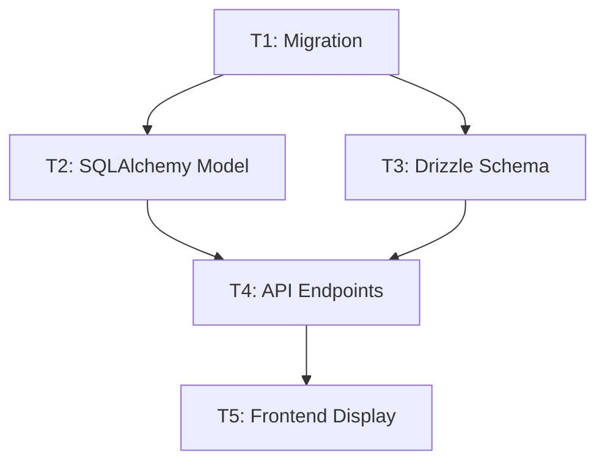

# Implementation Plan: Phase 009 - Advanced Pricing and Categorization

**Branch:** `009-advanced-pricing-categories`  
**Status:** Planning Complete  
**Date:** 2025-12-03

---

## Technical Context

| Aspect | Value | Status |
|--------|-------|--------|
| ORM | SQLAlchemy 2.0 AsyncIO | ✅ Resolved |
| Migration Tool | Alembic | ✅ Resolved |
| Decimal Type | `Numeric(10, 2)` | ✅ Resolved |
| Currency Storage | `String(3)` nullable | ✅ Resolved |
| Category Hierarchy | Adjacency list (existing) | ✅ No changes needed |

---

## Constitution Check

| Principle | Compliance | Notes |
|-----------|------------|-------|
| Single Responsibility | ✅ | Pricing fields serve distinct purpose |
| Separation of Concerns | ✅ | Data model → API → Frontend layered |
| Strong Typing | ✅ | Decimal for prices, validated String for currency |
| KISS | ✅ | Minimal new fields, reuses existing patterns |
| DRY | ✅ | Leverages existing Category entity |

**Gate Status:** ✅ PASSED - No violations

---

## Generated Artifacts

### Phase 0: Research

| Artifact | Path | Description |
|----------|------|-------------|
| Research | [`plan/research.md`](plan/research.md) | Technology decisions and rationale |

### Phase 1: Design & Contracts

| Artifact | Path | Description |
|----------|------|-------------|
| Data Model | [`plan/data-model.md`](plan/data-model.md) | Schema definitions, SQLAlchemy model |
| API Contract | [`plan/contracts/api.json`](plan/contracts/api.json) | OpenAPI 3.1 specification |
| Quickstart | [`plan/quickstart.md`](plan/quickstart.md) | 15-minute setup guide |

---

## Implementation Tasks

### T1: Database Migration (Critical)

**Files:**
- `services/python-ingestion/migrations/versions/009_add_pricing_fields.py`

**Changes:**
1. Add `retail_price DECIMAL(10,2) NULL`
2. Add `wholesale_price DECIMAL(10,2) NULL`
3. Add `currency_code VARCHAR(3) NULL`
4. Add CHECK constraints for non-negative prices

**Acceptance:**
- [ ] Migration runs without error
- [ ] Rollback works correctly
- [ ] Zero downtime (non-blocking ALTER)

---

### T2: SQLAlchemy Model Update (Critical)

**Files:**
- `services/python-ingestion/src/db/models/product.py`

**Changes:**
1. Add `retail_price: Mapped[Decimal | None]`
2. Add `wholesale_price: Mapped[Decimal | None]`
3. Add `currency_code: Mapped[str | None]`
4. Add `__table_args__` with CHECK constraints

**Acceptance:**
- [ ] Type hints correct
- [ ] Docstrings present
- [ ] Unit tests pass

---

### T3: Drizzle Schema Update (High)

**Files:**
- `services/bun-api/src/db/schema/schema.ts`

**Changes:**
1. Add `retailPrice` field
2. Add `wholesalePrice` field
3. Add `currencyCode` field
4. Add CHECK constraints

**Acceptance:**
- [ ] Schema introspection succeeds
- [ ] TypeScript types generated
- [ ] Bun tests pass

---

### T4: API Endpoints (High)

**Files:**
- `services/bun-api/src/controllers/catalog/products.controller.ts`
- `services/bun-api/src/controllers/admin/products.controller.ts`

**Changes:**
1. Include new fields in GET responses
2. Add PATCH endpoint for pricing updates
3. Validate currency code format

**Acceptance:**
- [ ] GET returns new fields
- [ ] PATCH validates input
- [ ] Admin role required for updates

---

### T5: Frontend Display (Medium)

**Files:**
- `services/frontend/src/components/catalog/ProductCard.tsx`
- `services/frontend/src/components/catalog/ProductDetail.tsx`
- `services/frontend/public/locales/en/translation.json`
- `services/frontend/public/locales/ru/translation.json`

**Changes:**
1. Display retail price (preferred) or wholesale price (fallback)
2. Show currency code alongside prices
3. Add i18n keys for labels

**Acceptance:**
- [ ] Prices display correctly
- [ ] Currency shows in ISO format
- [ ] Null prices show placeholder

---

## Dependencies



---

## Risk Mitigation

| Risk | Mitigation | Owner |
|------|------------|-------|
| Migration blocks table | Use NULL defaults (non-blocking) | DBA |
| Breaking API consumers | All fields nullable | Backend |
| Float precision issues | Using Numeric type | Backend |

---

## Rollback Plan

```bash
# 1. Rollback migration
cd services/python-ingestion
alembic downgrade -1

# 2. Revert SQLAlchemy model changes (git)
git checkout -- src/db/models/product.py

# 3. Regenerate Drizzle types
cd services/bun-api
bun run drizzle-kit introspect
```

---

## Next Phase: Implementation

After plan approval, proceed to implementation:

1. Run `quickstart.md` to set up data model
2. Implement API endpoints (T4)
3. Update frontend display (T5)
4. Update ML-Analyze parsers for dual pricing extraction

