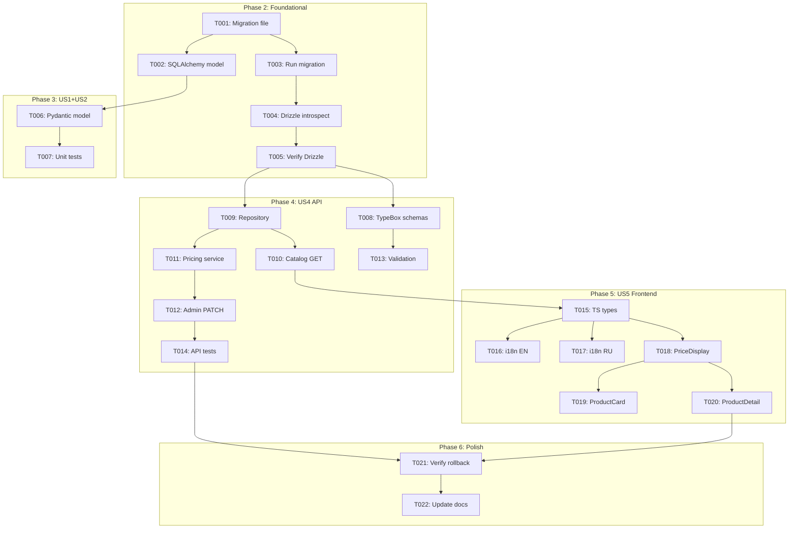

# Tasks: Phase 009 - Advanced Pricing and Categorization

**Feature:** Advanced Pricing and Categorization  
**Branch:** `009-advanced-pricing-categories`  
**Generated:** 2025-12-03  
**Total Tasks:** 22

---

## User Stories Summary

| Story | Name | Priority | Tasks |
|-------|------|----------|-------|
| US1 | Dual Pricing Fields | Critical | 4 |
| US2 | Currency Code Storage | Critical | 2 |
| US3 | Product-Category Association | High | 0 (existing) |
| US4 | API Pricing Endpoints | High | 7 |
| US5 | Frontend Pricing Display | Medium | 6 |

**Note:** US3 (Product-Category Association) requires no implementation - the Category entity with `parent_id` hierarchy already exists.

---

## Phase 1: Setup

_No setup tasks required - existing project infrastructure._

---

## Phase 2: Foundational (Database & Models)

**Goal:** Add pricing columns to database and update ORM models across services.

**Blocking:** All user story phases depend on this phase completing first.

### Tasks

- [ ] T001 Create Alembic migration file in `services/python-ingestion/migrations/versions/009_add_pricing_fields.py`
- [ ] T002 [P] Update SQLAlchemy Product model with new fields in `services/python-ingestion/src/db/models/product.py`
- [ ] T003 Run migration and verify schema changes via `alembic upgrade head`
- [ ] T004 Regenerate Drizzle schema via `bun run drizzle-kit introspect` in `services/bun-api/`
- [ ] T005 [P] Manually verify/update Drizzle schema in `services/bun-api/src/db/schema/schema.ts` if introspect misses constraints

### Acceptance Criteria

- [ ] Migration runs without error (`alembic upgrade head`)
- [ ] Migration rollback works (`alembic downgrade -1`)
- [ ] Products table has `retail_price`, `wholesale_price`, `currency_code` columns
- [ ] CHECK constraints exist for non-negative prices
- [ ] SQLAlchemy model has type hints and docstrings
- [ ] Drizzle schema includes new fields with correct types

---

## Phase 3: US1+US2 - Dual Pricing & Currency Storage [Critical]

**Goal:** Ensure database supports storing retail/wholesale prices with currency tracking.

**Story Reference:**
- FR-1: Dual Pricing Fields
- FR-2: Currency Code Storage

**Independent Test Criteria:**
- Insert product with retail_price=99.99, wholesale_price=79.99, currency_code='USD' → succeeds
- Insert product with retail_price=-5.00 → fails (CHECK constraint)
- Insert product with all pricing fields NULL → succeeds
- Update existing product to add pricing → succeeds

### Tasks

- [ ] T006 [US1] [US2] Create Pydantic validation model in `services/python-ingestion/src/models/product_pricing.py`
- [ ] T007 [US1] [US2] Add unit test for Product model pricing fields in `services/python-ingestion/tests/unit/test_product_pricing.py`

### Acceptance Criteria

- [ ] Pydantic model validates currency_code format (^[A-Z]{3}$)
- [ ] Pydantic model validates price >= 0
- [ ] Unit tests cover valid and invalid pricing scenarios

---

## Phase 4: US4 - API Pricing Endpoints [High]

**Goal:** Expose pricing fields in catalog API and provide admin update endpoint.

**Story Reference:** FR-4: API Pricing Endpoints

**Dependencies:** Phase 2 (Foundational)

**Independent Test Criteria:**
- GET /api/products returns `retail_price`, `wholesale_price`, `currency_code` in response
- GET /api/products/{id} returns pricing fields
- PATCH /api/admin/products/{id}/pricing updates pricing (admin role)
- PATCH with invalid currency_code returns 400 validation error
- PATCH without auth returns 401

### Tasks

- [ ] T008 [P] [US4] Create TypeBox schema for pricing fields in `services/bun-api/src/types/product.types.ts`
- [ ] T009 [US4] Update ProductRepository to select new pricing fields in `services/bun-api/src/db/repositories/product.repository.ts`
- [ ] T010 [US4] Update catalog products controller GET response in `services/bun-api/src/controllers/catalog/products.controller.ts`
- [ ] T011 [US4] Create pricing update service in `services/bun-api/src/services/product.service.ts`
- [ ] T012 [US4] Create admin pricing PATCH endpoint in `services/bun-api/src/controllers/admin/products.controller.ts`
- [ ] T013 [P] [US4] Add TypeBox currency code validation schema with regex pattern in `services/bun-api/src/types/product.types.ts`
- [ ] T014 [US4] Add API integration test for pricing endpoints in `services/bun-api/tests/admin/products.test.ts`

### Acceptance Criteria

- [ ] GET /api/products returns pricing fields (nullable)
- [ ] GET /api/products/{id} returns pricing fields
- [ ] PATCH /api/admin/products/{id}/pricing requires admin role
- [ ] PATCH validates currency_code format (400 on invalid)
- [ ] PATCH accepts partial updates (can update just retail_price)
- [ ] API tests pass

---

## Phase 5: US5 - Frontend Pricing Display [Medium]

**Goal:** Display dual pricing with currency in product views.

**Story Reference:** FR-5: Frontend Pricing Display

**Dependencies:** Phase 4 (US4 - API must return pricing fields)

**Independent Test Criteria:**
- Product list shows retail_price (or wholesale as fallback)
- Product detail shows both prices when available
- Currency code displays alongside prices (e.g., "99.99 USD")
- Null prices show placeholder ("—")
- All text is i18n-ready

### Tasks

- [ ] T015 [P] [US5] Add Product TypeScript type with pricing fields in `services/frontend/src/types/product.ts`
- [ ] T016 [P] [US5] Add i18n keys for pricing labels in `services/frontend/public/locales/en/translation.json`
- [ ] T017 [P] [US5] Add i18n keys for pricing labels in `services/frontend/public/locales/ru/translation.json`
- [ ] T018 [US5] Create PriceDisplay component in `services/frontend/src/components/shared/PriceDisplay.tsx`
- [ ] T019 [US5] Update ProductCard to show primary price in `services/frontend/src/components/catalog/ProductCard.tsx`
- [ ] T020 [US5] Update ProductDetail to show dual pricing in `services/frontend/src/components/catalog/ProductDetail.tsx`

### Acceptance Criteria

- [ ] ProductCard shows retail_price (fallback to wholesale_price)
- [ ] ProductDetail shows both prices labeled
- [ ] Currency code displays next to price values
- [ ] Null prices show "—" placeholder
- [ ] All labels use t() for i18n
- [ ] No TypeScript errors

---

## Phase 6: Polish & Cross-Cutting Concerns

**Goal:** Documentation, cleanup, and verification.

### Tasks

- [ ] T021 Verify migration rollback works via `alembic downgrade -1` then `alembic upgrade head`
- [ ] T022 Update CLAUDE.md with Phase 9 context in `/Users/valecer/work/sites/marketbel/CLAUDE.md`

### Acceptance Criteria

- [ ] Migration is fully reversible
- [ ] CLAUDE.md documents new pricing fields
- [ ] All services start without errors

---

## Dependencies Graph

---

## Parallel Execution Opportunities

### Phase 2 Parallel Group

After T001 (migration file created):
- T002 (SQLAlchemy model) — can proceed immediately
- T003 (run migration) — can proceed immediately

After T003 (migration applied):
- T004 (Drizzle introspect)
- T005 (verify Drizzle) — can run after T004

### Phase 3 Parallel Group

After T002:
- T006 (Pydantic model)
- T007 (unit tests) — after T006

### Phase 4 Parallel Group

After Phase 2 complete:
- T008 (TypeBox schemas) ‖ T009 (Repository) — parallel, different files

After T009:
- T010 (Catalog GET) ‖ T011 (Pricing service) — parallel, different files

After T008:
- T013 (Validation schema) — can run parallel with T010/T011

### Phase 5 Parallel Group

After T010 (API returns pricing):
- T015 (TS types) ‖ T016 (i18n EN) ‖ T017 (i18n RU) — all parallel, different files

After T015:
- T018 (PriceDisplay component)

After T018:
- T019 (ProductCard) ‖ T020 (ProductDetail) — parallel, different files

---

## Implementation Strategy

### MVP Scope (Recommended)

**MVP = Phase 2 + Phase 3 + Phase 4**

This delivers:
- ✅ Database stores dual pricing with currency
- ✅ API exposes pricing fields
- ✅ Admin can update pricing
- ❌ Frontend display (Phase 5) can follow

**MVP Task IDs:** T001-T014 (14 tasks)

### Incremental Delivery

| Increment | Tasks | Deliverable |
|-----------|-------|-------------|
| 1 | T001-T005 | Database ready |
| 2 | T006-T007 | Python models validated |
| 3 | T008-T014 | API complete |
| 4 | T015-T020 | Frontend complete |
| 5 | T021-T022 | Polish complete |

---

## File Summary

| Service | Files Modified/Created |
|---------|----------------------|
| python-ingestion | 3 files |
| bun-api | 5 files |
| frontend | 6 files |
| root | 1 file |

### Detailed File List

**python-ingestion:**
- `migrations/versions/009_add_pricing_fields.py` (new)
- `src/db/models/product.py` (modify)
- `src/models/product_pricing.py` (new)
- `tests/unit/test_product_pricing.py` (new)

**bun-api:**
- `src/db/schema/schema.ts` (modify/verify)
- `src/types/product.types.ts` (modify)
- `src/db/repositories/product.repository.ts` (modify)
- `src/controllers/catalog/products.controller.ts` (modify)
- `src/controllers/admin/products.controller.ts` (modify/create)
- `src/services/product.service.ts` (modify/create)
- `tests/admin/products.test.ts` (new)

**frontend:**
- `src/types/product.ts` (modify)
- `public/locales/en/translation.json` (modify)
- `public/locales/ru/translation.json` (modify)
- `src/components/shared/PriceDisplay.tsx` (new)
- `src/components/catalog/ProductCard.tsx` (modify)
- `src/components/catalog/ProductDetail.tsx` (modify)

**root:**
- `CLAUDE.md` (modify)

---

## Validation Checklist

Before marking feature complete:

- [ ] All 22 tasks completed
- [ ] Migration runs forward and backward cleanly
- [ ] Python unit tests pass (`pytest tests/unit/`)
- [ ] Bun API tests pass (`bun test`)
- [ ] Frontend type-checks (`bun run type-check`)
- [ ] No console errors in browser
- [ ] Pricing displays correctly for products with/without prices
- [ ] Admin can update pricing via API
- [ ] i18n works for EN and RU locales

